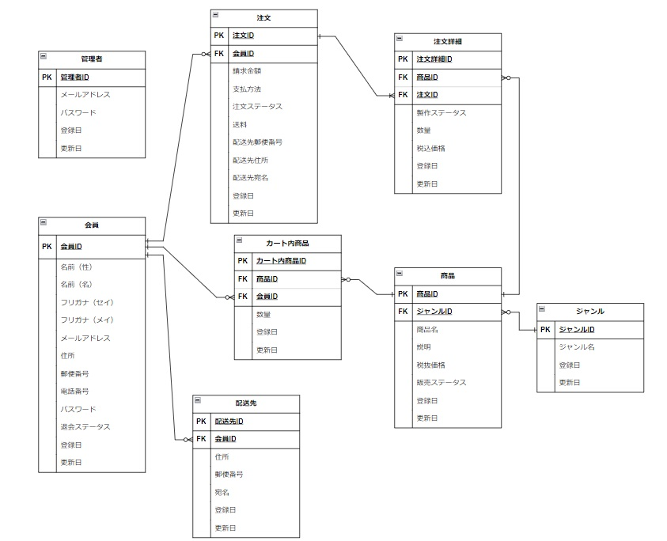

## アプリケーション名

**ながのCAKE～NaganoCake～**

## テーマ

 長野県にある小さな洋菓子店「ながのCAKE」の商品を通販するためのECサイトになります。

## アプリケーション使用方法
```
$ git clone git@github.com:bell-jack-noireon/nagano_cake.git
$ cd nagano_cake
$ bundle install
$ rails db:migrate
$ rails db:seed
$ rails s
```
## テスト用アカウント

**-管理者アカウント-**<br>
メールアドレス: admin@gmail.com<br>
パスワード: 111111<br>
管理者用ログインURL: /admin/sign_in


**-会員アカウント-**<br>
メールアドレス：public@gmail.com<br>
パスワード: 111111<br>

＊会員アカウントに限り、新規登録画面からアカウントの新規作成が可能です。

## 使用言語
- HTML
- CSS
- Ruby
- JavaScript

**フレームワーク**
- Ruby on Rails

## 機能概要

管理者側の機能
- ログイン後、ヘッダーが自動で管理者用に変更される。
- 商品の登録、編集、削除が可能。
- 商品のジャンル登録、編集が可能。
- 商品の販売ステータス「販売中」「販売停止中」の切り替えが可能。
- 会員一覧画面から各会員の会員ステータスが「有効」か「退会済」かを確認可能。
- 注文履歴一覧画面から、注文を受けた全ての商品の注文ステータスを一覧で確認可能。
- 注文履歴詳細画面から、注文ステータスと製作ステータスの変更が可能。ここで変更された商品の注文ステータスは、紐づいている会員側の商品の注文ステータスに反映される。<br>＊注文ステータスと製作ステータスの連動について<br>１：注文ステータスを「入金確認」にすると、製作ステータスが全て「製作待ち」に更新される。<br>２：製作ステータスを一つでも「製作中」にすると、注文ステータスが「製作中」に更新される。<br>３：製作ステータスを全て「製作完了」にすると、注文ステータスが「発送準備中」に更新される。

会員側の機能
- アカウント登録、ログインをしなくても「ながのCAKE」の商品の閲覧が可能。
- ジャンル一覧からジャンルを選択し、特定のジャンルに絞って商品を表示可能。
- ログイン後、ヘッダーが自動で会員用に変更される。
- アカウント登録及び、ログインを行った後に配送先の登録、カート機能、注文機能が利用可能となる。
- 商品の配送先は複数登録可能。
- 自身のアカウント内の登録情報の編集が可能。
- 商品を注文してから届くまでの状況を、注文履歴一覧画面から注文ステータスとして確認可能。
- 会員はアカウント削除を行い、「ながのCAKE」からの退会が可能。
- 退会後は、同じメールアドレスでのアカウント再登録が不可能となる。


## gem一覧

| gem | 目的 |
----  | ----
|devise| ユーザー認証機能の実装 |
|enum_help| 日本語化機能の実装 |
|kaminari| ページネーションの実装 |
|bootstrap| レイアウト機能の実装 |
|font-awesome| アイコンの取得 |

## ER図


## 動作環境
- Ruby ver_3.1.2
- Rails ver_6.1.7.4

## 開発者
チーム：**ベルジャック・ノイレオン**
- 大塚 駿太
- 会田 裕哉
- 古賀 聖矢
- 関上 乃衣
